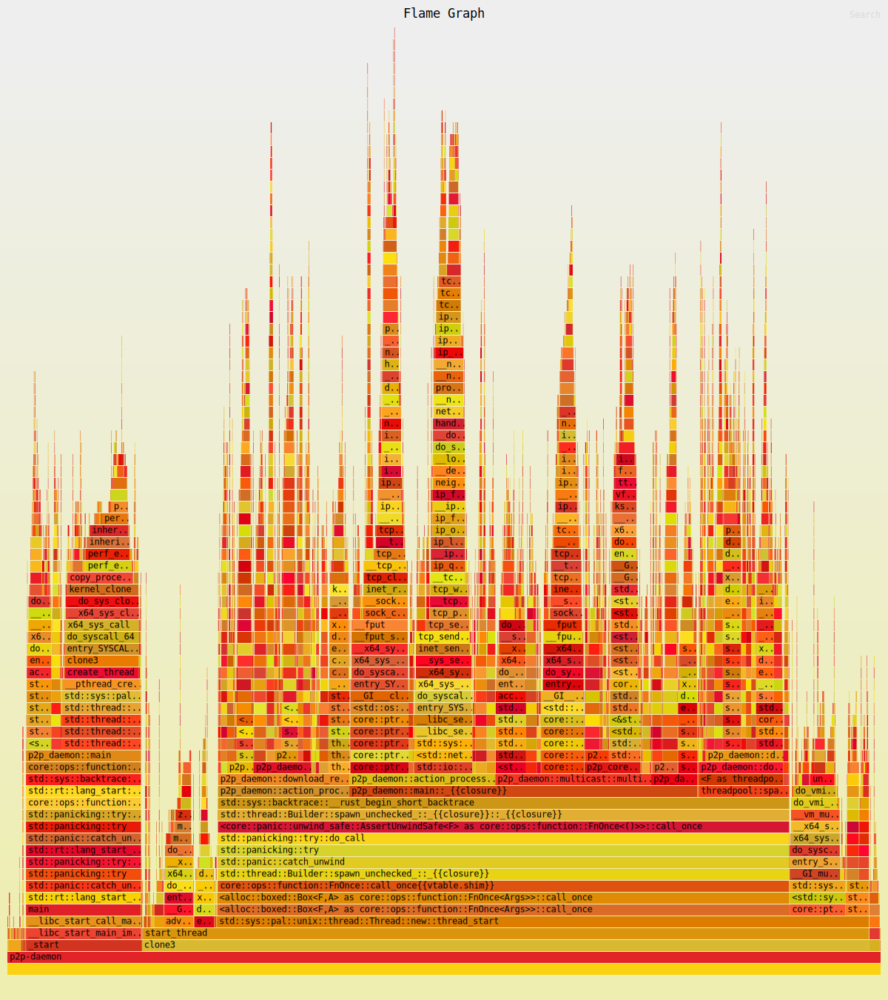

# P2P File Sharing Daemon & CLI

A peer-to-peer file sharing application written in Rust.

The system has two parts:

- **Daemon** — runs locally, discovers peers via multicast, shares files, and serves file chunks to other peers.
- **CLI** (`p2p-cli`) — talks to the daemon over TCP to share, scan, list, download, and view status.

> Downloading is **chunk-based**: a file is split into fixed-size blocks (e.g. `CHUNK_SIZE = 4096`). The client may fetch different blocks from **multiple seeders** in parallel (torrent-style).

---

## Quickstart

### 1) Build

```bash
cargo build --release
```

### 2) Start the daemon

```bash
./target/release/p2p-daemon
```

The daemon will:

- determine its LAN IP and join the multicast group;
- listen for scan requests and reply with its shared files;
- serve chunked uploads to downloading peers.

### 3) Use the CLI

```bash
./target/release/p2p-cli <command> [args]
```

---

## CLI commands

### `share <PATH>`
Share a file with the LAN.

```bash
p2p-cli share ./myfile.txt
```

### `scan`
Broadcast a scan request to discover files shared by peers.

```bash
p2p-cli scan
```

### `ls`
List files currently available to download (after a scan).

```bash
p2p-cli ls
```

### `download -f <NAME> [-o <OUT_DIR>] [-w]`
Download by file name.

- `-f, --file <NAME>` — file name to download (required)  
- `-o, --out <OUT_DIR>` — optional output directory (defaults to current dir)  
- `-w, --wait` — block the CLI until the download completes

```bash
# Download into current directory
p2p-cli download -f myfile.txt

# Download into ./downloads and wait until finished
p2p-cli download -f myfile.txt -o ./downloads -w
```

### `status`
Show current status (shared files, transfers, downloads).

```bash
p2p-cli status
```

---

## How it works (technical notes)

- **Discovery:** peers use UDP multicast to announce/scan available files.
- **Control channel:** the CLI talks to the local daemon over TCP; daemons also use TCP to exchange file lists and to transfer chunks.
- **Chunking:** files are split into blocks of size `CHUNK_SIZE`. The last block may be smaller.
- **Parallelism:** when multiple seeders report the same file size, the downloader splits the block ranges among them and fetches ranges concurrently.
- **Integrity:** ranges are written at their offsets. If any range fails and cannot be recovered, the partial file is removed.
- **Logging:** verbosity is controlled by the project’s `Logger` (see code). Typical setups use an env var or config flag to choose level.

---

## Configuration

- Network addresses, ports, and `CHUNK_SIZE` are defined in project config (`p2p_config`).
- Platform specifics are handled via `#[cfg(windows)]`/`#[cfg(unix)]` where needed.

---

## Build, test, run

```bash
# Build
cargo build

# Run daemon (in one terminal)
./target/debug/p2p-daemon

# Use CLI (in another terminal)
./target/debug/p2p-cli scan
./target/debug/p2p-cli ls
```

Run tests:

```bash
cargo test
```

---

## Profiling

### 1. Generate constant client activity
Run continuous client interactions in a separate terminal to keep the daemon busy during profiling:

```bash
while true; do
    ./target/release/p2p-cli scan
    ./target/release/p2p-cli download -f my-message.txt
done
```

### 2. Profile the running daemon for 30 seconds
First, get the daemon's PID:
```bash
pidof p2p-daemon
# example output:
21224
```

Then run `perf` against that PID:
```bash
sudo perf record -F 999 -p 21224 --call-graph dwarf -- sleep 30
```

You can abort the client activity loop after profiling completes.

### 3. View the report
```bash
sudo perf report
```

---

## Flamegraph



### 1. Enable debug symbols for release builds
In your `Cargo.toml`, add:
```toml
[profile.release]
debug = true # for profiling
```

### 2. Allow `perf` without root (until next reboot)
```bash
echo -1 | sudo tee /proc/sys/kernel/perf_event_paranoid
echo 0  | sudo tee /proc/sys/kernel/kptr_restrict
```

### 3. Run `cargo-flamegraph`
```bash
cargo flamegraph --release --bin p2p-daemon
```

### 4. Open the generated SVG
After the process finishes (via `Ctrl+C` or normal exit):
```bash
xdg-open flamegraph.svg
# or
firefox flamegraph.svg
```

### Notes on Sampling Frequency (`-F`)

The `-F` option in `perf record` controls the sampling frequency (samples per second per thread).

- **Higher frequency** (e.g., `-F 999`) gives more precise profiles, especially for short-lived or very fast functions, but:
  - Increases overhead on the CPU.
  - Produces larger `perf.data` files.
  - Can distort timings if the target process is sensitive to profiling load.

- **Lower frequency** (e.g., `-F 99` or `-F 199`) is usually sufficient for longer profiling sessions or when looking for major hotspots.

**Guideline:**
- Use `-F 99` for general, long-running profiling.
- Use `-F 199` or `-F 499` for medium-length sessions when more detail is needed.
- Reserve `-F 999` for short (10–30s) sessions focusing on high-precision, CPU-bound code.

Example:
```bash
# Safe, general-purpose sampling
sudo perf record -F 99 -p <PID> --call-graph dwarf -- sleep 30

# High-precision sampling for a short period
sudo perf record -F 999 -p <PID> --call-graph dwarf -- sleep 15
```

---

## Limitations / TODO

- No persistent resume of partially downloaded files after daemon restart.
- No per-chunk hashing yet (peer size agreement is used to filter mismatches).
- Basic error handling/logging; refine retries/backoff and diagnostics.

---
